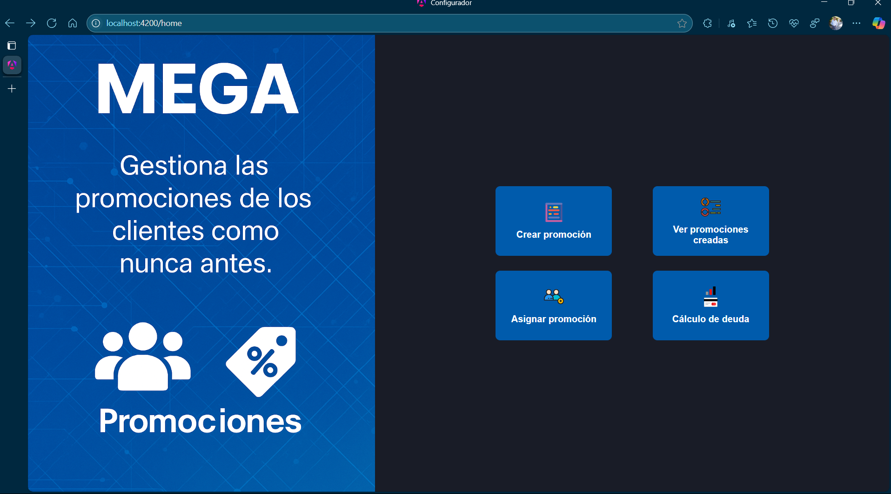
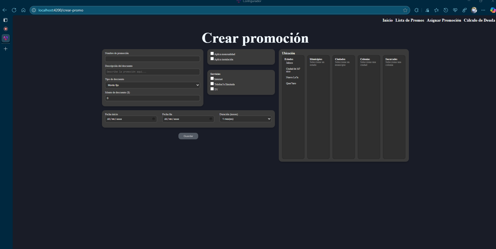
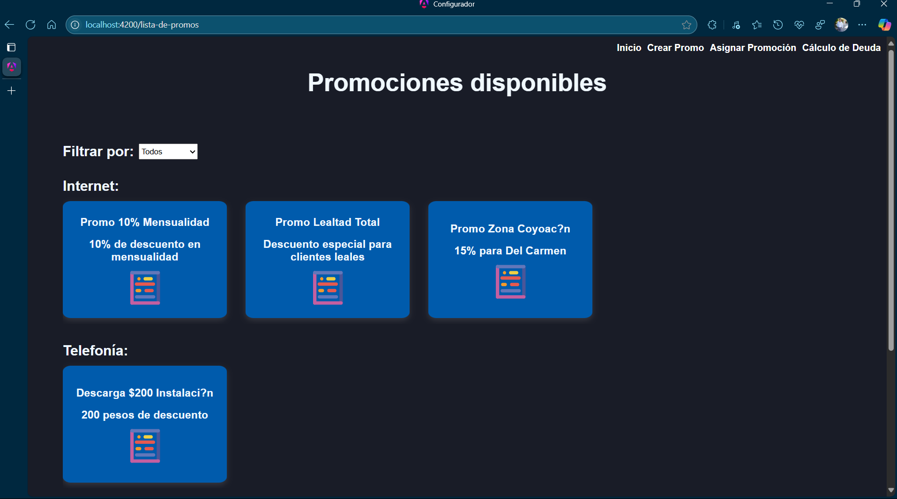
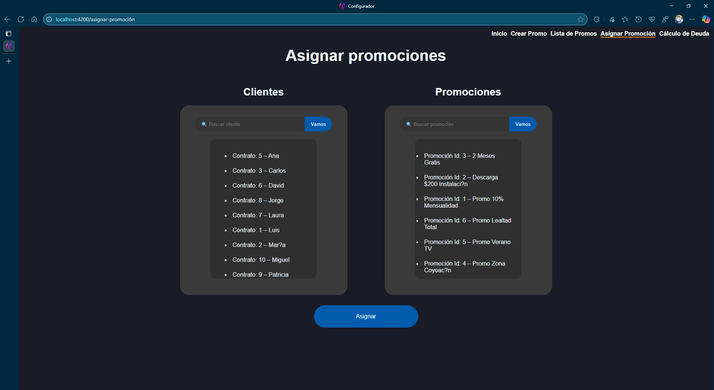
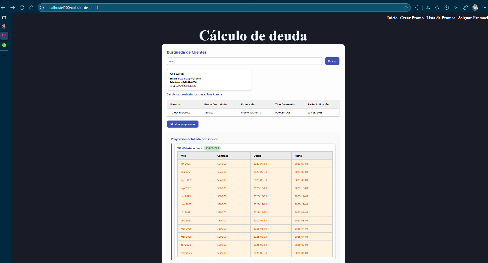

# Cálculo de deuda Eq3 Frontend

## 📄 Descripción

Esta es una App Web en la que puedes manejar listas de promociones, asignarlas a clientes asi como crearlas y hacer una proyección del cálculo de deuda de cada cliente
El
 Home pone a disposición las siguientes paginas:

- Crear promoción
- Ver lista de promociones creadas
- Asignar una una promoción a algún cliente
- Calcular una proyección de deuda por cliente
  
---

## 🎯 Objetivo

Elaborar una App para manejar, asignar y calcular la deuda del cliente tomando en cuenta restricciones geográficas, de servicios y duraciones de cada promoción para mostrar nuestras habilidades individuales y de trabajo en equipo ante Mega

---

## 🛠️ Stack Tecnológico

- HTML  
- CSS  
- Angular y TypeScript
- ESLint

---

## 👀 Vista del proyecto

- Home

Esta página muestra un banner del lado izquierdo y una serie de botones del lado derecho que nos dirigen a las diferentes funcionalidades del APP las cuales son:

- Crear promoción
- Ver lista de promociones creadas
- Asignar promociones a algún cliente
- Calcular una proyección de la deuda de algún cliente

- Crear promoción
Una ventana dedicada a crear una nueva promoción en la cuál puedes personalizar los campos:

- Aplica a: mensualidad o a instalación
- Nombre y descripción
- Monto aplicable (teniendo en cuenta que no apliquen números negativos)
- Fecha de inicio y fin (ventana para aprovechar la promoción)
- duración de la promoción una ves aplicada al cliente
- Ubicación geográfica aplicable (se puede ajustar por Ciudad, Colonias, municipios y sucursales, totalmente personalizable)

- Listar promociones creadas
Se pueden filtrar por el servicio al que aplican: Telefonía, Internet o TV Por cable ademas de desplegar un modal para ver toda la información de una promoción en especifico que incluye:

- Id de la promoción
- Descripción
- Tipo de descuento
- Valor del descuento
- Modalidad de aplicación
- Duración
- Ventana de oportunidad para aplicación
- Servicio al que aplica

- Asignar promociones a clientes
Es una vista dedicada a aplicar las promociones a los clientes la cual valida si estas son aplicables para el cliente seleccionado. Cuenta con una interface que se actualiza dinámicamente cuando seleccionas un usuario al que quieres aplicar la promoción para solo mostrar las promociones que cumplen con los criterios aplicables a la lógica de negocio como:

- Que el cliente tenga ese servicio contratado
- Que el cliente no la tenga signada ya esa promoción

además de contar con barras de búsqueda independientes para clientes y promociones en las cuales se puede filtrar por: 

- Id
- Nombre del cliente o de la promo

- Cálculo de deuda y proyección
Esta es una vista dedicada a hacer el calculo de la deuda de un cliente y a hacer una proyección de los pagos subsecuentes validando la fecha fin de las promociones que el cliente tiene aplicadas

la UX se maneja mediante la búsqueda de un cliente para después listar los servicios que tiene contratados y cual será el monto de su pago ademas de un botón que mostrara una proyección a futuro de los pagos a realizar

## Bibliotecas y dependencias utilizadas

- Rxjs 7.8.0
- typescript-eslint 8.27.0
- eslint 9.23.0
- angular/common/http 18.2.0
